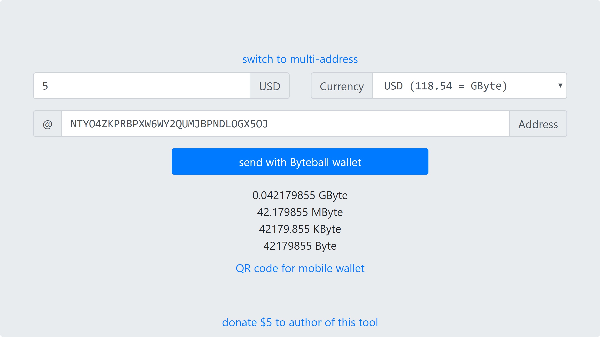

# Currency converter for Obyte (formerly Byteball)
This is a stand-alone currency conversion tool for Obyte wallet, which supports converting 24 different currencies (including USD, EUR, BTC & ETH) into GByte, MByte, KByte and Byte amounts and if Obyte wallet is already installed then it opens the wallet where user can simply click Send to initiate the payment. This tool solves the problem that Obyte wallet doesn't have a built-in currency conversion tool for sending amount values other than native currency.

## Pre-filling inputs
It is possible to prefill form fields to request somebody to send, for example, 5 USD by sending them a [link like this](https://tarmo888.github.io/bb-convert/#amount=5&currency=USD&address=NTYO4ZKPRBPXW6WY2QUMJBPNDLOGX5OJ) (obviously with your own address). Just type in new values and it generates a new link on your browser address bar.

## Blackbytes conversion
Blackbytes are [private assets on Obyte](https://bitcointalk.org/index.php?topic=1574508). These assets are not send from wallet to wallet, but from device to device because only spender proof is posted on DAG, rest of the coins history is stored in added to file that can be sent to anyone else. This currency converter helps to calculate [exact amount from many currencies into blackbytes amounts](https://tarmo888.github.io/bb-convert/black.html#amount=1&currency=USD&address=). When clicking on Copy button (GBByte, MBByte, KBByte or BByte - depending what unit you have selected in your wallet app), it will copy the amount into your clipboard that can be pasted to wallet app.

## Custom currency rate
If there is some currency missing from the list of currencies, but you know the rate then it is also possible to enter your own custom rate and it will create [link like this](https://tarmo888.github.io/bb-convert/#amount=5&currency=2500&address=).

## Custom assets amount converter
This currency conversion tool can also be used to convert custom asset amounts. There are 2 options for that, you either enter a [custom currency rate for your custom asset like this](https://tarmo888.github.io/bb-convert/custom.html#amount=1&currency=0.001&address=NTYO4ZKPRBPXW6WY2QUMJBPNDLOGX5OJ&asset=IYzTSjJg4I3hvUaRXrihRm9%2BmSEShenPK8l8uKUOD3o%3D) or if your custom asset is pegged to GBYTE then you could also let the users select, which 24 other currencies they want to convert, this can be done by adding with [`price_bytes` parameter in the URL](https://tarmo888.github.io/bb-convert/custom.html#amount=1&currency=USD&address=NTYO4ZKPRBPXW6WY2QUMJBPNDLOGX5OJ&asset=IYzTSjJg4I3hvUaRXrihRm9%2BmSEShenPK8l8uKUOD3o%3D&price_bytes=0.0001).

## QR code generator
There is also a QR code generator on this tool that could be useful for seller, who can enter the number in their local currency and show the QR code to buyer. Just fill all fields correctly and `QR code for mobile wallet` link will appear under the calculated amounts.

## Multi-address list generator
Obyte wallet supports sending to multiple addresses, which can be entered as 2 column (comma separated address and amount) list. This tool has a [multi-address mode](https://tarmo888.github.io/bb-convert/multi.html), but instead lets users enter the total amount they want to send and all the addresses they want to send to. By default, it will split the total amount equally (un-equally if some addresses appear multiple times) between the addresses and will generate the address list with amounts, which are compatible to be pasted into Obyte wallet. It also accepts any other 2 column (comma separated address and amount) lists in case user wants to add weight to some addresses, so these would get proportionally bigger amount. When clicking on Copy button (GByte, MByte, KByte or Byte - depending what unit you have selected in your wallet app), it will generate a new list into your clipboard that can be pasted to wallet app.

## TESTNET wallet
This tool also lets you launch a [TESTNET wallet](https://obyte.org/testnet.html) instead [MAINNET wallet](https://obyte.org/#download) by adding a `testnet=1` param to URL fragment [like this](https://tarmo888.github.io/bb-convert/#testnet=1).

## License
MIT

## Thanks
* https://gist.github.com/aaronk6/d801d750f14ac31845e8
* https://github.com/indrimuska/jquery-editable-select
* https://github.com/jeromeetienne/jquery-qrcode
* https://github.com/jquery/jquery
* https://github.com/twbs/bootstrap/tree/v4-dev
* https://github.com/jackmoore/autosize
* https://github.com/tholman/github-corners
